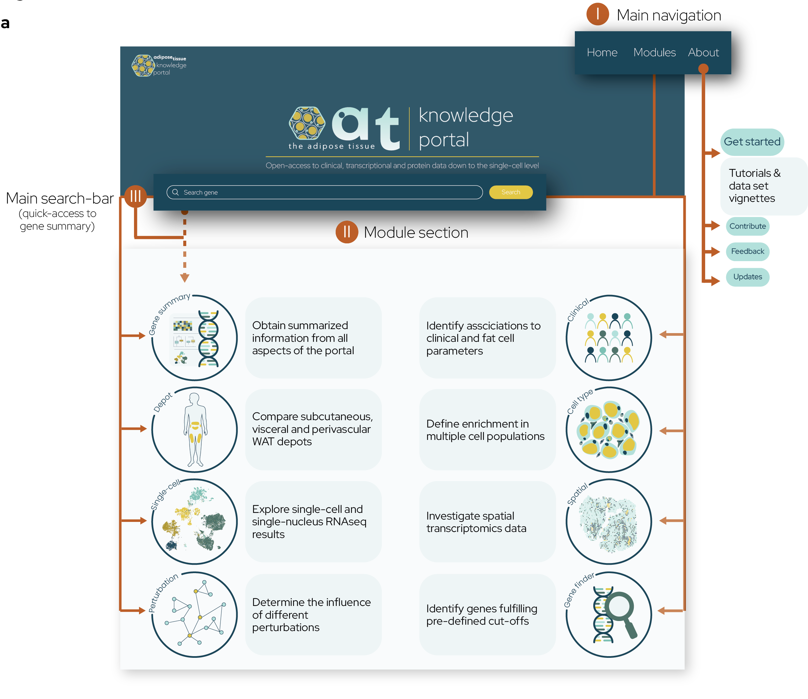

# The Adipose Tissue Knowledge Portal

The Adipose Tissue (AT) knowledge portal is a comprehensive collection of large scale transcriptome and proteome datasets with multiple layers, including bulk, single cell and spatial modalities, clinical datasets, adipocyte cell line characterizations as well as in vitro perturbations. The AT portal allows an easy exploration of candidate genes and their relevance on adipose tissue biology and clinical relevance. The inclusion of multiple large scale clinical cohorts allows the easy generation of meta-analysis. The portal can be accessed via [adiposetissue.org](https://adiposetissue.org/). If you want to contribute to the AT portal, either by providing data, improving the code, or giving general feedback, please contact Lucas Massier (lucas.massier@helmholtz-munich.de), Mikael Rydén (mikael.ryden@ki.se) or Niklas Mejhert (niklas.mejhert@ki.se).

