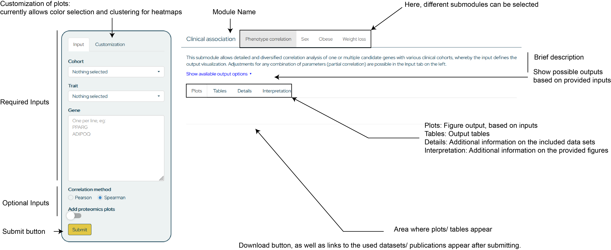

# How to use and navigate the Adipose Tissue Knowledge Portal

## Gene Summary

The easiest way to use the AT portal, is to enter a gene name into the search bar on the starting page. This will open the Gene Summary Module (which has the same search bar), and provide an overview across all available modules. 

  

