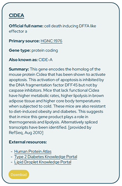

# How to use and navigate the Adipose Tissue Knowledge Portal

## Gene Summary

The easiest way to use the AT portal, is to enter a gene name into the search bar on the [starting page](adiposetissue.org). This will open the Gene Summary Module (which has the same search bar), and provide a comprehensive overview across all available modules. 

  

The sidebar on the left side displays key information for the queried gene.

| Section | Description |
| --- | --- |
| Gene Symbol | Provided Gene Symbol, Links out to NCBI Gene Summary |
| Gene Name | Official gene name from the HUGO Gene Nomenclature Committee (HGCN) |
| Source | Links to the HGNC |
| Known as | Gene aliases |
| Description | Gene description from NCBI Gene |
| External Resources | Links to <ul><li>Human Protein Atlas</li><li>T2D Knowledge Portal</li><li>LD Knowledge Portal</li></ul> |
| Download | Download All Summay Files as PDF |

---

## Clinical Relationships

